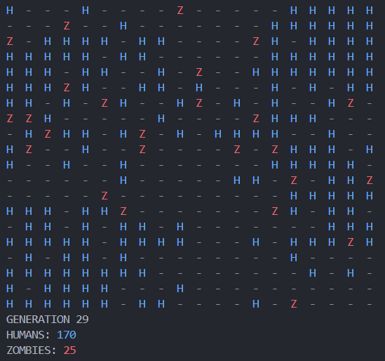

# Zombies - CLI Organism Simulation

This project is a C++ command-line simulation of a grid-based world where humans and zombies interact. The simulation models the behavior of organisms (humans and zombies) as they move, reproduce, and interact with each other over time.



---

## Features
- **Grid-Based Simulation**: A 20x20 grid where humans and zombies coexist.
- **Dynamic Interactions**:
  - Humans can breed after a certain number of steps.
  - Zombies can starve if they don't eat for a certain number of steps.
  - Zombies can convert humans into zombies.
- **Customizable Parameters**: Modify constants like grid size, breeding intervals, and starvation thresholds in [`GameSpecs.h`](inc/GameSpecs.h).
- **Real-Time Updates**: The simulation updates dynamically with a short pause between steps.

---

## How It Works
1. **Initialization**:
   - The grid is populated with a predefined number of humans and zombies.
   - Humans and zombies are placed randomly on the grid.

2. **Simulation Loop**:
   - Each organism takes a turn to move, breed, or interact with others.
   - Zombies prioritize eating humans, while humans focus on survival and reproduction.
   - The simulation ends when either all humans or all zombies are eliminated, or a maximum number of iterations is reached.

---

## Getting Started

### Prerequisites
- **C++ Compiler**: GCC (MinGW), Clang, or MSVC.
- **CMake**: Version 3.26 or higher.
- **Ninja** (optional): For faster builds.

### Building the Project
1. Clone the repository:

    ```bash
    git clone <repository-url>
    cd zombies
    ```
2. Configure the project using CMake:

    ```bash
    cmake -S . -B build
    ```
3. Build the project:

    ```bash
    cmake --build build
    ```
4. Run the executable:

    ```bash
    build\zombies.exe
    ```
### Configuration
You can modify the simulation parameters in GameSpecs.h:

- GRID_SIZE: Size of the grid (default: 20x20).
- HUMAN_STARTCOUNT: Initial number of humans.
- ZOMBIE_STARTCOUNT: Initial number of zombies.
- HUMAN_BREED: Steps required for humans to breed.
- ZOMBIE_STARVE: Steps before a zombie starves.
- ITERATIONS: Maximum number of simulation steps.